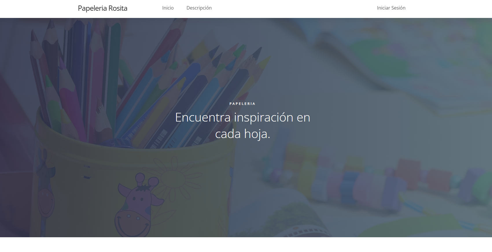
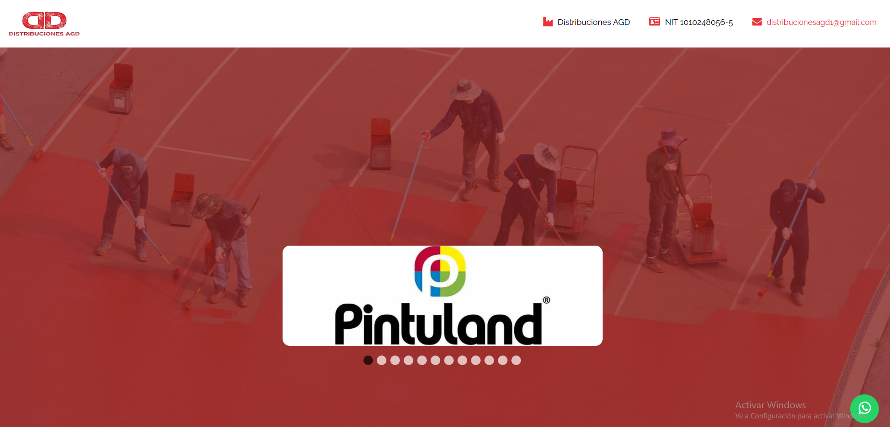
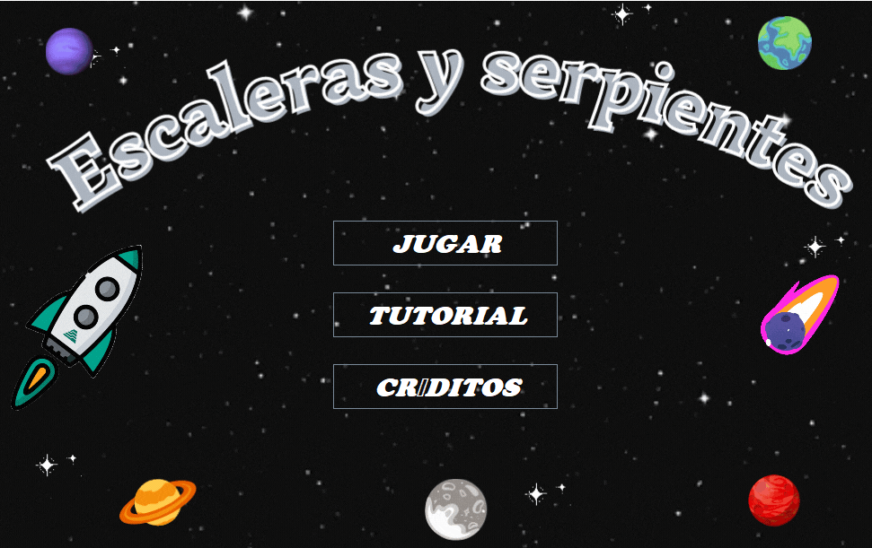

  

<h2>Kevin Gonzalez</h2>

  <strong>Cloud & DevOps Engineer · Data Governance · Full-Stack Developer</strong> 
  Bogotá, Colombia · <a href="mailto:kgagudelo@gmail.com">kgagudelo@gmail.com</a> · <a href="https://linkedin.com/in/kagonzalezdev">LinkedIn</a>

Ingeniero de Sistemas (UEB, 2026) con experiencia en arquitectura cloud, gobierno de datos y desarrollo full-stack. Construyo desde aplicaciones web y móviles con IA hasta sistemas de producción con pagos, pipelines de datos y arquitectura serverless en AWS.

<h3>Stack</h3>

  
  
  
  
  
  
  
  
  
  
  
  

 

<table>
  <tr>
    <td><strong>Data & Gov</strong></td>
    <td>DAMA-DMBOK · Great Expectations · Databricks · Power BI · PySpark · Metadatos · Linaje</td>
  </tr>
  <tr>
    <td><strong>Cloud & DevOps</strong></td>
    <td>AWS (Lambda, EC2, S3, RDS) · Azure · Docker · Kubernetes · Terraform · GitHub Actions · CI/CD</td>
  </tr>
  <tr>
    <td><strong>Backend</strong></td>
    <td>Python · FastAPI · Java · Spring Boot · Node.js · REST · JWT</td>
  </tr>
  <tr>
    <td><strong>Frontend</strong></td>
    <td>TypeScript · React · Flutter/Dart · JavaScript · Three.js · HTML/CSS</td>
  </tr>
  <tr>
    <td><strong>AI / LLMs</strong></td>
    <td>LangChain · LlamaIndex · RAG · OpenAI · Anthropic · Prompt Engineering</td>
  </tr>
  <tr>
    <td><strong>Bases de datos</strong></td>
    <td>MySQL · PostgreSQL · Oracle · MariaDB · DynamoDB · Supabase</td>
  </tr>
</table>

 

---

<h2>Proyectos</h2>

<h3>FocusZone — Plataforma de bienestar digital</h3>

  <a href="https://github.com/revkelo/FocusZone">Repositorio</a>

App web de productividad para estudiantes UEB — Pomodoro, retos semanales, IA (Lumi), push notifications y leaderboard. Proyecto de grado con Catalina Barrera. <strong>TypeScript · React 19 · Supabase · Vite · Vercel</strong>

---

<h3>AsisVoz — Transcripción de audio/video con IA</h3>

  <a href="https://github.com/revkelo/AsisVoz">Repositorio</a>

App de escritorio para transcribir audio y video con Deepgram, exportar a PDF/DOCX con timestamps y diarización de hablantes. Módulo QA para hacer preguntas al documento con DeepSeek. <strong>Python · Deepgram · OpenRouter · CustomTkinter · PyInstaller</strong>

---

<h3>Migracion365 — Google Drive a OneDrive</h3>

  <a href="https://github.com/revkelo/Migracion365">Repositorio</a>

Herramienta de escritorio para que profesores y estudiantes de la UEB migren su contenido de Google Drive a Microsoft OneDrive, preservando estructura de carpetas y convirtiendo formatos Google Workspace. <strong>Python · Google Drive API · Microsoft MSAL · CustomTkinter</strong>

---

<h3>KanbanAPP — Tablero Kanban multiplataforma</h3>

  <a href="https://github.com/revkelo/Kanban-Flutter">Repositorio</a>

App Kanban offline-first con drag & drop, modo oscuro/claro, notificaciones y APK de release incluido. Sin cuenta, sin backend. <strong>Flutter · Dart · Android · iOS · Web · Desktop</strong>

---

<h3>CEA-Serverless — Sistema académico en AWS</h3>

  <a href="https://github.com/revkelo/CEA-Serverless">Repositorio</a>

Sistema de gestión para el CEA Instituto de Movilidad (escuela de conducción) en arquitectura serverless AWS. <strong>Python · AWS Lambda · API Gateway · DynamoDB · S3 · SAM</strong>

---

<h3>ClipMagico — Sistema POS</h3>

  <a href="https://github.com/revkelo/ClipMagico">Repositorio</a>

Punto de venta con panel de administrador y vendedor — clientes, productos, proveedores, ventas y facturas conectado a MySQL. <strong>Java · Jakarta Servlet · MySQL · Bootstrap</strong>

  

---

<h3>Distribuciones AGD — Sitio web corporativo</h3>

  <a href="https://github.com/revkelo/Distribuciones-AGD">Repositorio</a>

Página web para ferretería y tienda de pinturas colombiana con catálogo, botón WhatsApp Business y diseño responsive. <strong>HTML · CSS · JavaScript · Bootstrap · Owl Carousel</strong>

  

---

<h3>Serpientes y Escaleras</h3>

  <a href="https://github.com/revkelo/serpientes-y-escaleras">Repositorio</a>

Primer proyecto personal completo — juego de escritorio con 3 tableros, 4 jugadores, fichas personalizadas, fondos animados y tutorial integrado. <strong>Java · Swing · MVC</strong>

  

---

<h2>Contacto</h2>

📧 <a href="mailto:kgagudelo@gmail.com">kgagudelo@gmail.com</a>

