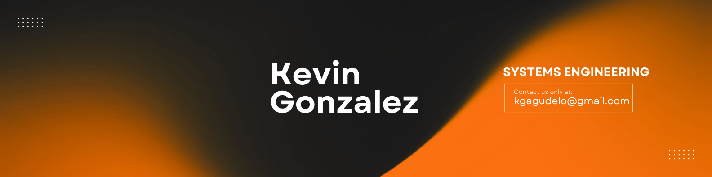

<p align="center">
  
</p>

<p align="center">
  
</p>

<p align="center">
  <a href="https://linkedin.com/in/kagonzalezdev">
    
  </a>
  <a href="mailto:kgagudelo@gmail.com">
    
  </a>
  
  
</p>

---

### 👋 Sobre mí

Ingeniero de Sistemas (UEB, 2026 — *Mención Meritoria*) con experiencia práctica en **desarrollo full-stack**, **arquitecturas cloud en AWS**, **gobernanza de datos** e **integración de IA**. He liderado proyectos que van desde pipelines de calidad de datos con DAMA-DMBOK y Great Expectations en entornos Databricks/PySpark, hasta migraciones empresariales a Microsoft 365, apps móviles multiplataforma y sistemas serverless en producción.

Mi proyección está orientada hacia **Cloud Infrastructure & DevOps** — diseño de arquitecturas escalables, IaC con Terraform, orquestación con Kubernetes y pipelines CI/CD en AWS. Me interesa especialmente la intersección entre infraestructura cloud y plataformas de datos, donde la ingeniería de plataforma habilita decisiones en tiempo real.

```python
kevin = {
    "experiencia": ["Full-Stack Dev", "Cloud & DevOps", "Data Governance", "AR/VR"],
    "proyeccion":  ["Cloud Infrastructure", "Platform Engineering", "MLOps"],
    "stack":       ["Python", "FastAPI", "Java", "TypeScript", "Flutter", "AWS"],
    "cloud":       ["AWS Lambda", "DynamoDB", "S3", "Terraform", "Docker", "K8s"],
    "data":        ["DAMA-DMBOK", "Great Expectations", "Databricks", "PySpark", "Power BI"],
    "AI":          ["LangChain", "RAG", "OpenAI", "Anthropic", "LlamaIndex"],
    "location":    "Bogotá 🇨🇴",
    "wip":         "MonetIQ — finanzas personales con IA 🚀"
}
```

---

### 🛠️ Tech Stack

<p align="center">
  <br/>
  <br/>
  
</p>

<p align="center">
  
  
  
  
  
</p>

---

### 📊 GitHub Stats

<p align="center">
  
  
</p>

<p align="center">
  
</p>

---

### 🚀 Proyectos

#### 🔒 MonetIQ *(próximamente)*
App móvil + backend web para **finanzas personales con IA** — análisis de gastos, WhatsApp webhook, recomendaciones inteligentes.


---

#### 🔒 SOM 3D — [3Dvinci Studios](https://3dvincistudios.com) *(privado)*
Pipeline web para convertir estudios **DICOM en modelos médicos 3D** — segmentación automática con TotalSegmentator, reconstrucción de mallas STL, visualización interactiva en navegador con Three.js y gestión de hospitales, médicos y pacientes con pagos integrados (ePayco). *Proyecto de grado — Nominado a Mención Meritoria.*


---

#### [FocusZone](https://github.com/revkelo/FocusZone) — Bienestar digital UEB
Plataforma de productividad: Pomodoro, retos semanales, asistente IA (Lumi), push notifications y leaderboard. *Proyecto de grado.*


---

#### [AsisVoz](https://github.com/revkelo/AsisVoz) — Transcripción con IA
App de escritorio: transcribe audio/video con Deepgram, exporta PDF/DOCX con diarización. Módulo Q&A con DeepSeek.


---

#### [Migracion365](https://github.com/revkelo/Migracion365) — Google Drive → OneDrive
Herramienta para migrar toda la UEB de Google Drive a Microsoft 365, preservando permisos y estructura.


---

#### [CEA-Serverless](https://github.com/revkelo/CEA-Serverless) — AWS Serverless
Sistema de gestión para escuela de conducción en arquitectura serverless AWS.


---

#### [Kanban-Flutter](https://github.com/revkelo/Kanban-Flutter) — Kanban multiplataforma
Tablero Kanban offline-first con drag & drop, modo oscuro/claro y APK de release incluido.


---

#### [sap-data-quality-greatexpectations](https://github.com/revkelo/sap-data-quality-greatexpectations) — Data Quality en SAP
Pipeline de calidad de datos para dominios SAP (Clientes/Proveedores) con Great Expectations en Databricks + PySpark.


---

<p align="center">
  <em>⭐ Si algún proyecto te fue útil, considera darle una estrella</em>
</p>
