<body>

    

¡Hola! Soy Kevin Gonzalez, un estudiante de Ingeniería de Sistemas. Me apasiona el desarrollo de software y la resolución de problemas a través de la programación. Aquí encontrarás algunos de mis proyectos y contribuciones en diferentes tecnologías y lenguajes.

¡Gracias por visitar mi perfil de GitHub! Espero que encuentres interesantes mis proyectos y contribuciones. No dudes en explorar los repositorios y ponerte en contacto conmigo si tienes alguna pregunta o propuesta. ¡Hagamos cosas geniales juntos! 

<h2>Sobre mí</h2>

<ul>
    <li>📚 Actualmente estoy cursando el cuarto semestre de mi carrera de Ingeniería de Sistemas.</li>
    <li>💻 Me especializo en el desarrollo de aplicaciones utilizando Java y tecnologías relacionadas.</li>
    <li>⚙️ Algunas de las tecnologías y frameworks que manejo son Spring Boot, JSF, JSP y Bootstrap.</li>
    <li>🌱 Estoy siempre aprendiendo y mejorando mis habilidades de programación.</li>
    <li>🎓 Me encanta participar en proyectos desafiantes y colaborar en equipos de desarrollo.</li>
</ul>

    <h3>🔨 Lenguajes y Herramientas:</h3>
    
    &nbsp;
    &nbsp;
    &nbsp;
    &nbsp;
    &nbsp;
    &nbsp;
    

<h2>Proyectos</h2>

<h3>CEA</h3>

<a href="https://github.com/revkelo/CEA" target="_blank">Repositorio</a>

Sistema de gestión para una escuela de conducción, que permite asignar clases y exámenes, y gestionar la disponibilidad de los estudiantes. <strong>Lenguaje: Java</strong>

    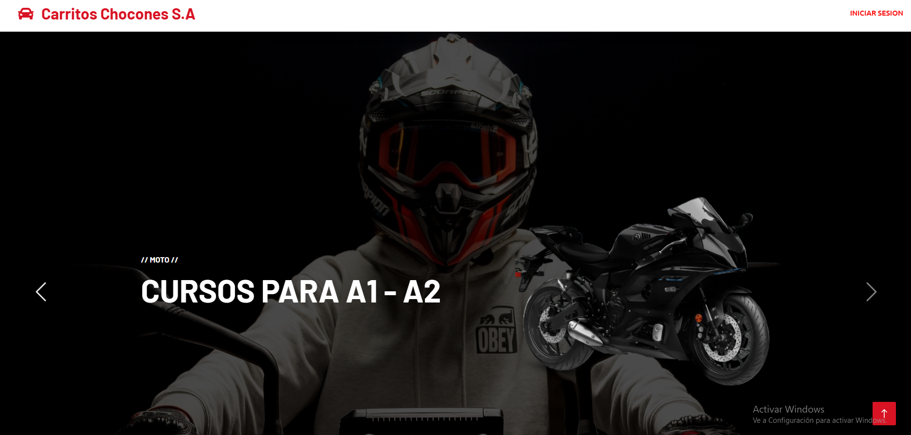
    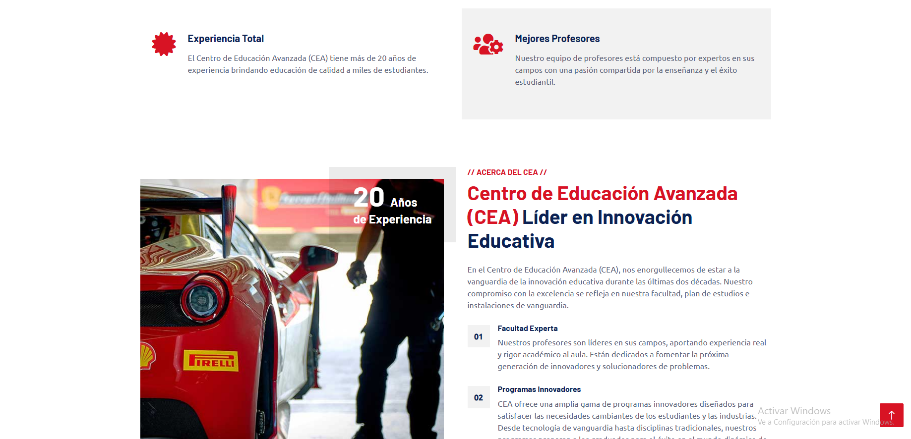

<h3>Andina Trading</h3>

<a href="https://github.com/revkelo/CEA" target="_blank">Repositorio</a>

Sistema de gestión para una escuela de conducción, que permite asignar clases y exámenes, y gestionar la disponibilidad de los estudiantes. <strong>Lenguaje: Java</strong>

    
    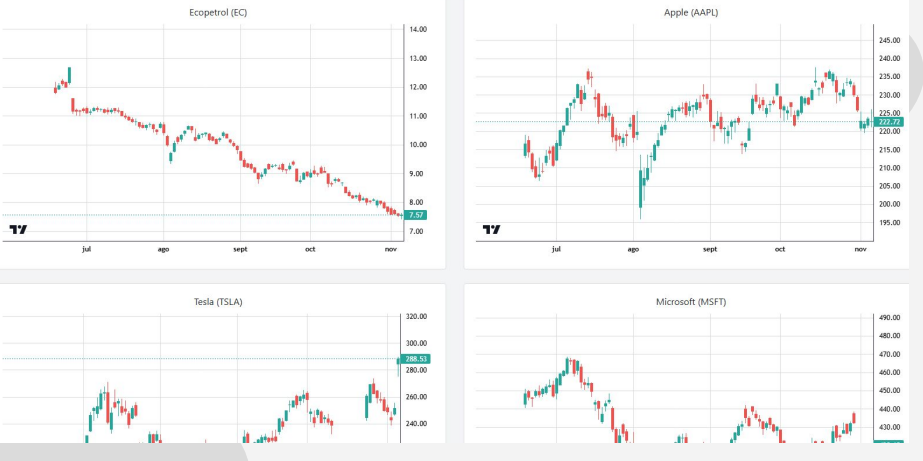
    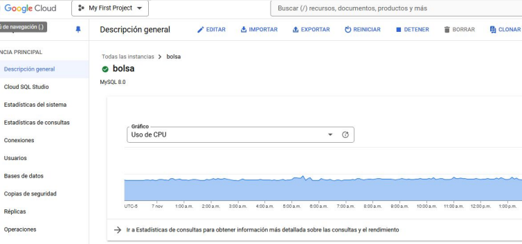

<h3>ClipMagico</h3>

<a href="https://github.com/revkelo/ClipMagico" target="_blank">Repositorio</a>

Sistema de gestión para una papelería, que controla cuentas, inventarios, clientes y proveedores, con seguimiento de ingresos y gastos. <strong>Lenguaje: Java</strong>

    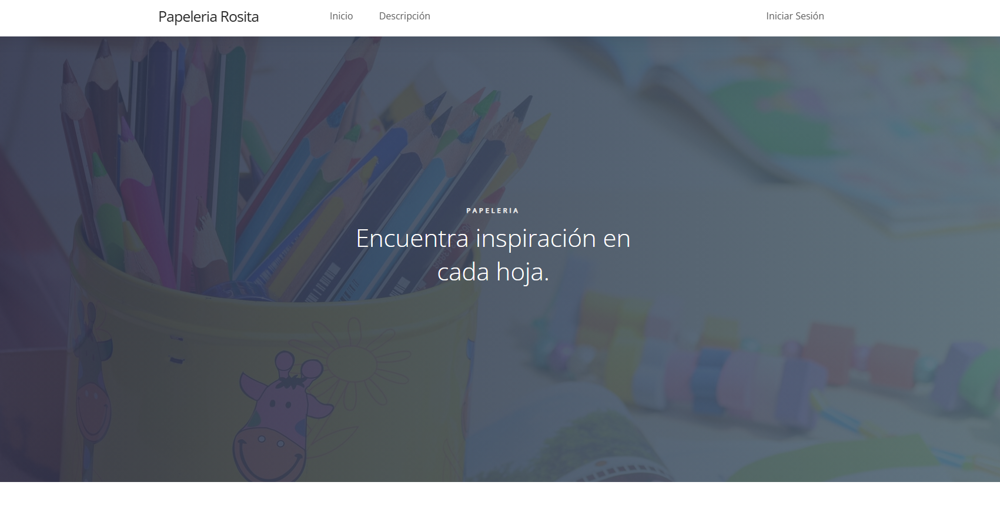
    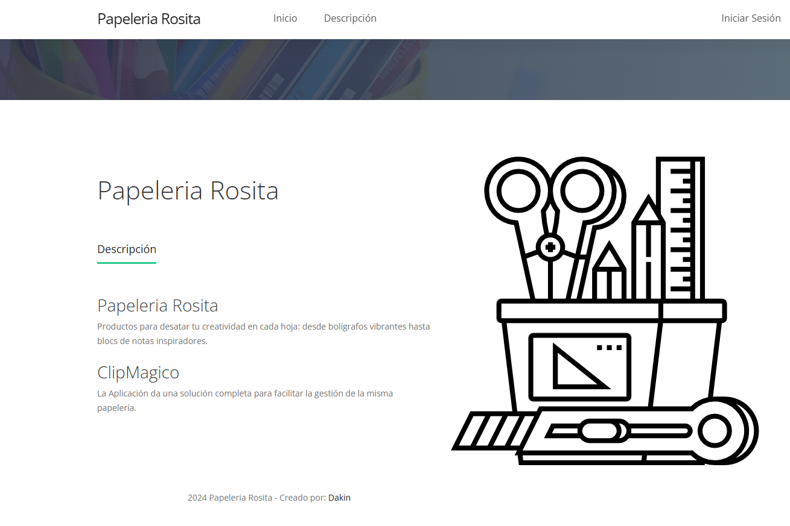

<h3>ACCIONES CORP</h3>

<a href="https://github.com/revkelo/Acciones-Frontend" target="_blank">Repositorio</a>

Sistema de corretaje para la compra y venta de acciones, con gestión de portafolios y transacciones en tiempo real. <strong>Lenguaje: Java</strong>

    
    

<h3>Aspirantes Universidad El Bosque</h3>

<a href="https://github.com/revkelo/Aspirantes-UEB-Proyecto" target="_blank">Repositorio</a>

Sistema de inscripción para aspirantes a la Universidad El Bosque, gestionando registros y seguimientos administrativos. <strong>Lenguaje: Java</strong>

    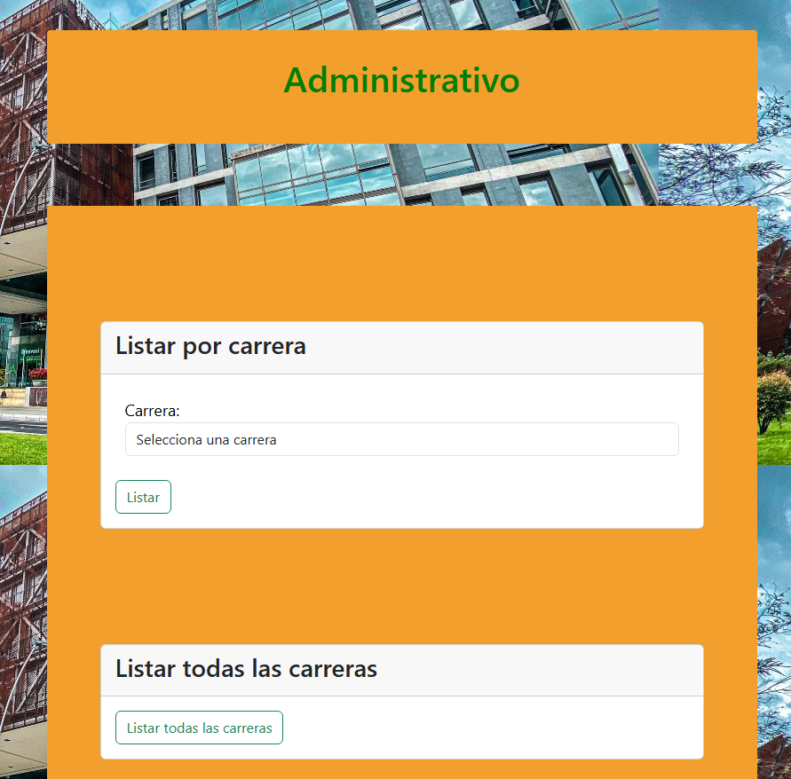

<h3>Bostinder</h3>

<a href="https://github.com/revkelo/Bostinder" target="_blank">Repositorio</a>

Proyecto en Java similar a Tinder, donde los usuarios pueden crear perfiles, buscar otros y establecer conexiones según preferencias. <strong>Lenguaje: Java</strong>

    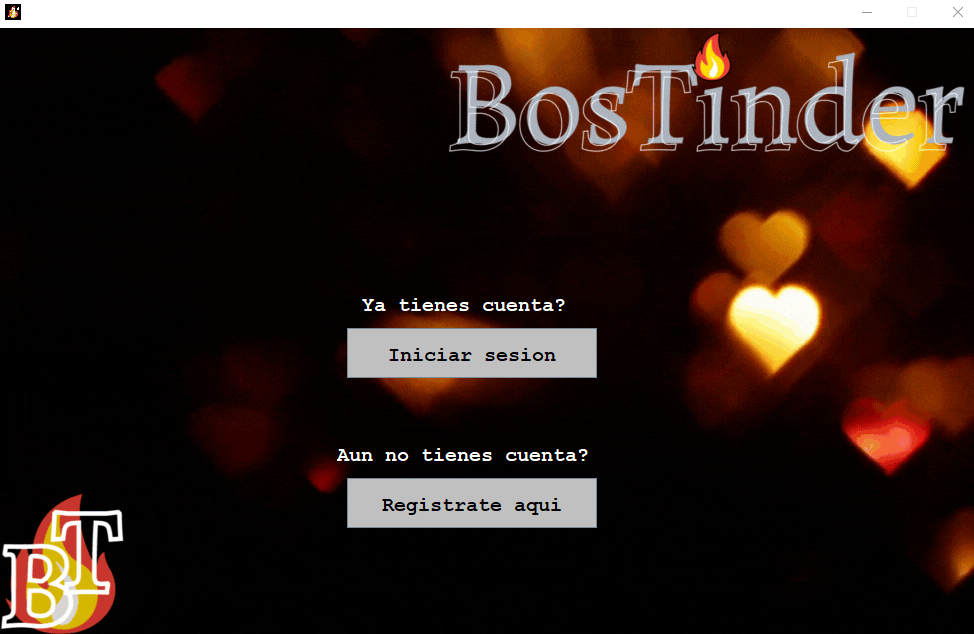
    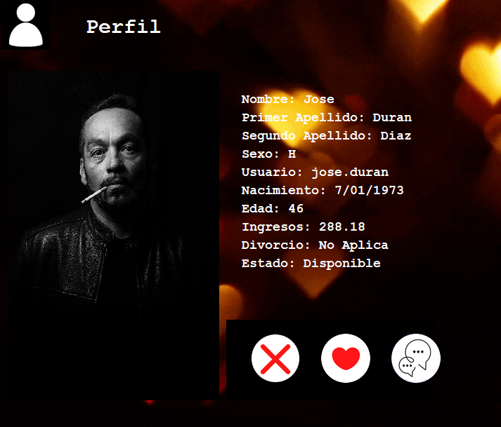
    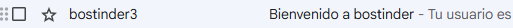

<h3>Escalera y Serpientes</h3>

<a href="https://github.com/revkelo/Serpientes-Y-Escaleras1" target="_blank">Repositorio</a>

    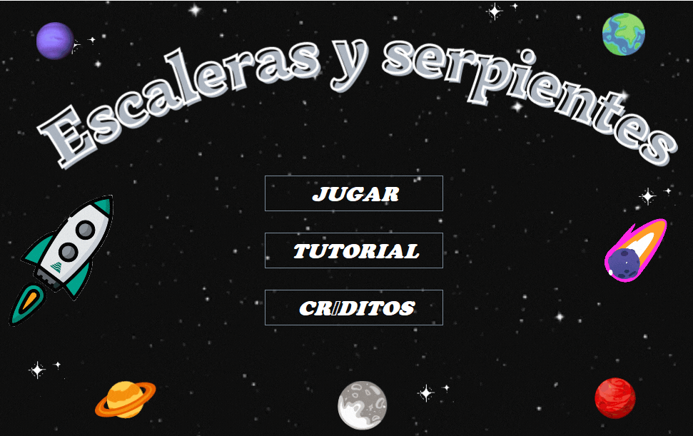
    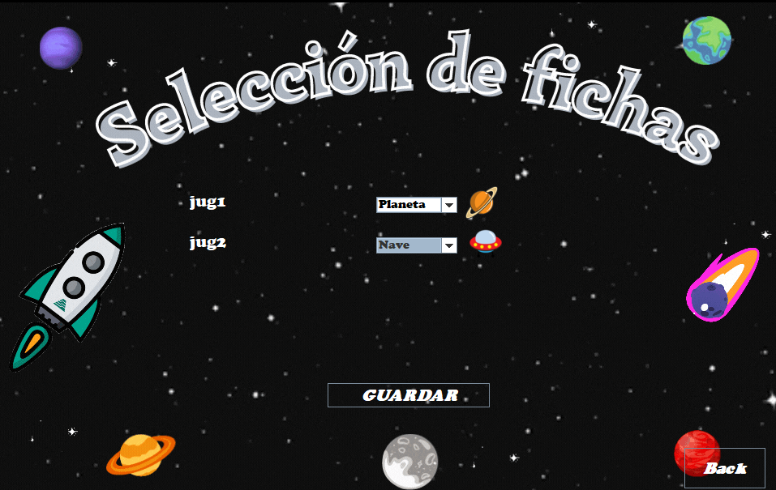
    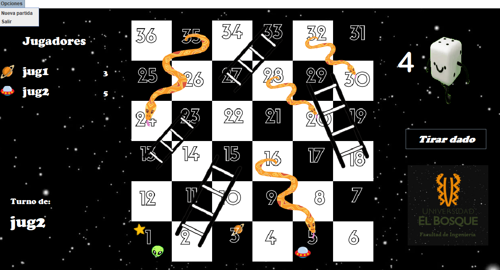

<h3>Distribuciones-AGD</h3>

<a href="https://github.com/revkelo/Distribuciones-AGD" target="_blank">Repositorio</a>

<a href="https://revkelo.github.io/Distribuciones-AGD/" target="_blank">Página Web Distribuciones AGD</a>

    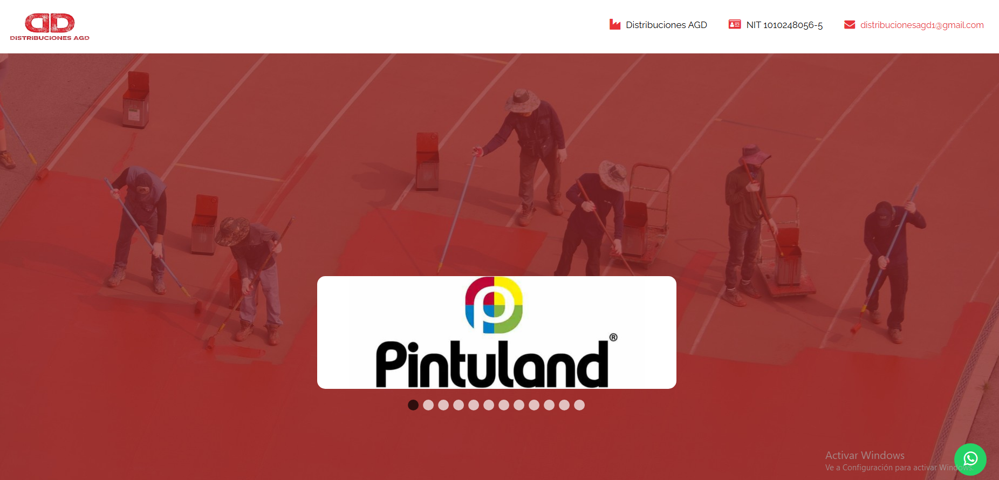

<h3>Administrativo-Servidor</h3>

<h3>IPV4 CALCULATOR</h3>

<a href="https://github.com/revkelo/IPV4-CALCULATOR" target="_blank">Repositorio</a>

<a href="https://revkelo.github.io/IPV4-CALCULATOR/" target="_blank">Página IPV4</a>

    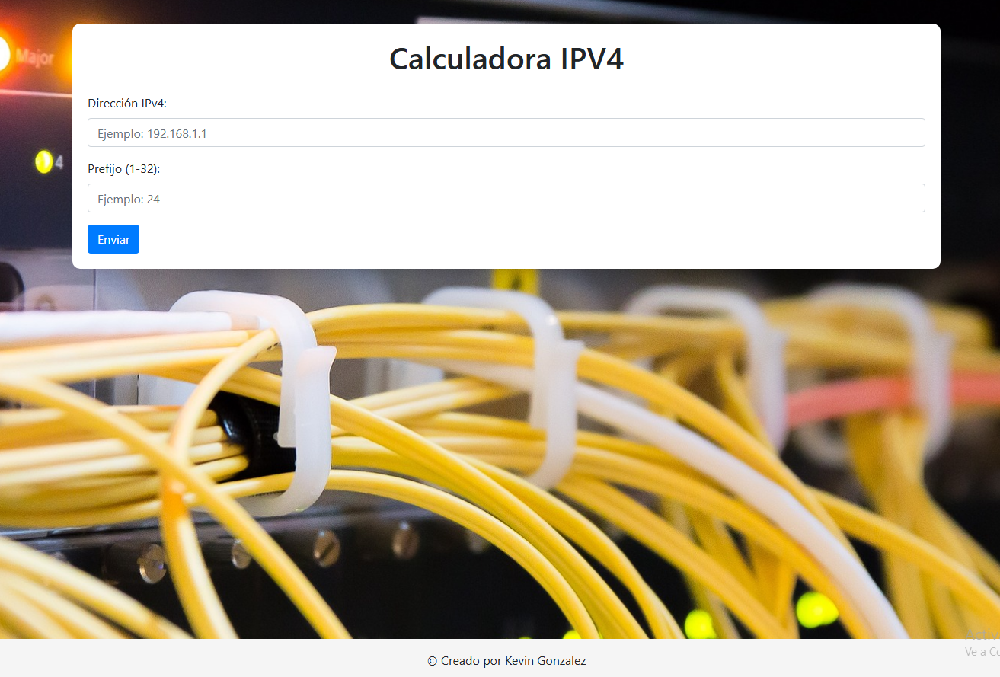

<h3>CaballoComplejidad</h3>

<a href="https://github.com/revkelo/Distribuciones-AGD" target="_blank">Repositorio</a>

    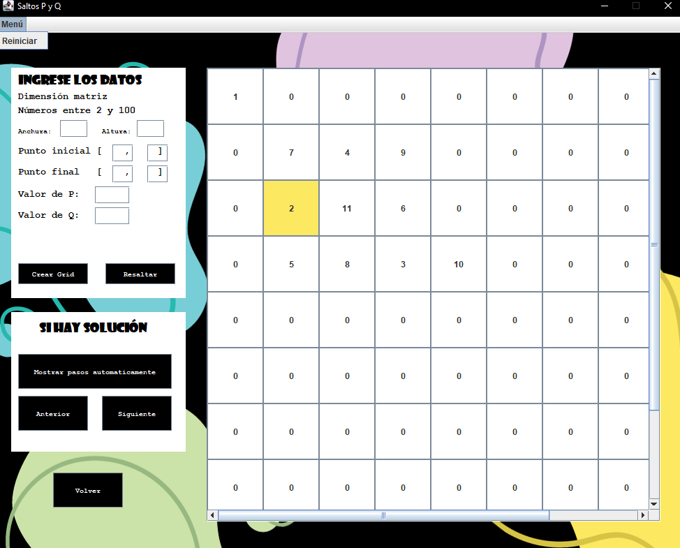

<h2>Contacto</h2>

Si estás interesado en colaborar en proyectos emocionantes o simplemente quieres conectarte, ¡no dudes en contactarme!

Correo electrónico: <a href="mailto:kgagudelo@gmail.com">kgagudelo@gmail.com</a>

</body>
